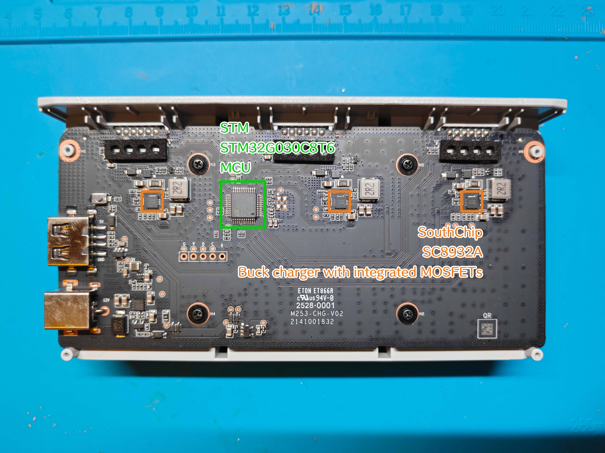

# 电池和充电器

## 硬件

### 主板图示

图片和图片上的标注是本人拍摄和绘制的

### 硬件详细信息

|      类型      |  制造商   |     型号      |       规格       |                         手册或详情页                         |
| :------------: | :-------: | :-----------: | :--------------: | :----------------------------------------------------------: |
|  嵌入式控制器  |    STM    | STM32G030C8T6 | 64Mhz Cortex-M0+ | [详情页](https://www.st.com/en/microcontrollers-microprocessors/stm32g030c8.html) |
| 锂电池充电芯片 | SouthChip |    SC8932A    |                  |     [详情页](https://www.southchip.com/product/SC8932A)      |

---

## 通信

### 引脚定义

Potensic ATOM 2 使用智能电池，以 2.0mm 6-PIN 刀片型电池连接器与机身和充电器相连，并使用 UART 与它们通讯

电池的引脚定义以充电管家正面 (带有 LED 和按键) 为参考

| 编号 | 引脚 |                   描述                   |
| :--: | :--: | :--------------------------------------: |
|  1   |  R   |     UART，电池 BMS 上报数据到充电器      |
|  2   |  N   |   GND，在充电器中也被用于检测电池接入    |
|  3   |  P   |                   VCC                    |
|  4   |  P   |                   VCC                    |
|  5   |  N   |                   GND                    |
|  6   |  T   | UART，充电器发送控制信号、心跳到电池 BMS |

### 数据包

*部分字段的含义是通过猜测得到的，可能缺少证据支撑，这一部分的字段将被星号标记。可能会在未来修订*

#### 充电器

充电器在引脚 6 上向电池发送数据，长度是 13 字节，内容是控制信号或心跳

| 偏移 |  字段名  | 长度 |     数值     |                        描述                         |
| :--: | :------: | :--: | :----------: | :-------------------------------------------------: |
|  0   | Header 1 |  1B  |     0xFF     |                     帧起始符 1                      |
|  1   | Header 2 |  1B  |     0xFE     |            帧起始符 2 (充电器标识, 0xFE)            |
|  2   |  Length  |  1B  |     0x09     |              后续数据长度 (Byte 3-11)               |
|  3   | Channel  |  1B  |  0x00~0x02   |            充电通道号 (对应 3 槽充电器)             |
|  4   | Command  |  1B  |     0x98     |                    状态轮询命令                     |
|  5   | Reserved |  1B  |     0x00     |                        预留                         |
|  6   | Control  |  1B  | 0x01 或 0x00 |            是否开启充电 (1:开启, 0:关闭)            |
| 7-10 | Padding  |  4B  |     0x00     |                      填充字节                       |
|  11  |   Mode   |  1B  | 0x10 或 0x00 | 是否有外部电源接入 (0x10: 外部电源接入, 0x00: 空闲) |
|  12  | Checksum |  1B  |  XOR Result  |             Byte 2 至 Byte 11 的异或和              |

#### 电池

电池 BMS 在引脚 1 上向机身或充电器发送数据，长度是 49 字节，内容是电池 BMS 的一些信息

| 偏移  |  字段名  | 长度 |    数值    |            描述             |
| :---: | :------: | :--: | :--------: | :-------------------------: |
|   0   | Header 1 |  1B  |    0xFF    |         帧起始符 1          |
|   1   | Header 2 |  1B  |    0xFD    | 帧起始符 2 (电池标识, 0xFD) |
|   2   |  Length  |  1B  |    0x2D    |   载荷长度长度 (45 字节)    |
|   3   | Echo Ch  |  1B  |  Channel   |   回显充电器发送的通道号    |
|   4   | Echo Cmd |  1B  |    0x98    |   回显充电器发送的命令字    |
|   5   | Reserved |  1B  |    0x00    |            预留             |
| 6-45  | Payload  | 40B  | Encrypted  |    电池 BMS 数据 (加密)     |
| 46-47 | * Suffix |  2B  | 0x01 0x84  |     固定后缀 / 硬件标识     |
|  48   | Checksum |  1B  | XOR Result | Byte 2 至 Byte 47 的异或和  |

电池 BMS 发送的数据中，有 40 字节的加密内容，加密内容使用双层 DES 加密

下面是加密内容在解密后的明文结构，按照大端序排列

| 偏移 |     字段名      | 单位 |   数值   |                 描述                 |
| :--: | :-------------: | :--: | :------: | :----------------------------------: |
|  0   | Cell 1 Voltage  |  mV  |  uint16  |         第 1 节电芯实时电压          |
|  1   | Cell 2 Voltage  |  mV  |  uint16  |         第 2 节电芯实时电压          |
| 2-3  | * Cell 3-4 Ext  |  -   |  uint16  |                 扩展                 |
|  4   | * Status Flags  | Mask |  uint16  |    0x00C0 代表 CHG/DSG FET 均开启    |
|  5   |   Cycle Count   |  -   |  uint16  |             电池循环次数             |
|  6   |  Remaining Cap  | mAh  |  uint16  |       剩余可用电量 (绝对容量)        |
|  7   | Full Charge Cap | mAh  |  uint16  |         电池当前实际满充容量         |
|  8   | * Time To Empty | min  |  uint16  |     剩余续航时间 (0xFFFF 为未知)     |
|  9   |   Temperature   |  K   |  uint16  |              开尔文温度              |
|  10  |      RSOC       |  %   |  uint16  |      相对剩余容量百分比 (0-100)      |
|  11  |     Current     |  mA  |  int16   |     实时电流: 正为充电, 负为放电     |
|  12  |  Total Voltage  |  mV  |  uint16  |   电池组端总电压 (Cell 1 + Cell 2)   |
|  13  |  * Avg Current  |  mA  |  int16   |           修正后的平均电流           |
|  14  |       SOH       |  %   |  uint16  | 电池健康度 (当前容量 / 上次满充容量) |
|  15  | * Max Chg Curr  |  mA  |  uint16  |      电池允许的最大充电电流限制      |
|  16  | * Hardware Rev  |  -   |  uint16  |        硬件版本号 (如 0x0184)        |
|  17  |    Device ID    |  -   |  uint8   |          设备 ID (如 0x76)           |
|  18  |   FW Version    |  -   | Bitfield | 字节 36: Major; 字节 37: Minor/Patch |
|  19  |   * Build ID    |  -   |  uint8   |              编译流水号              |