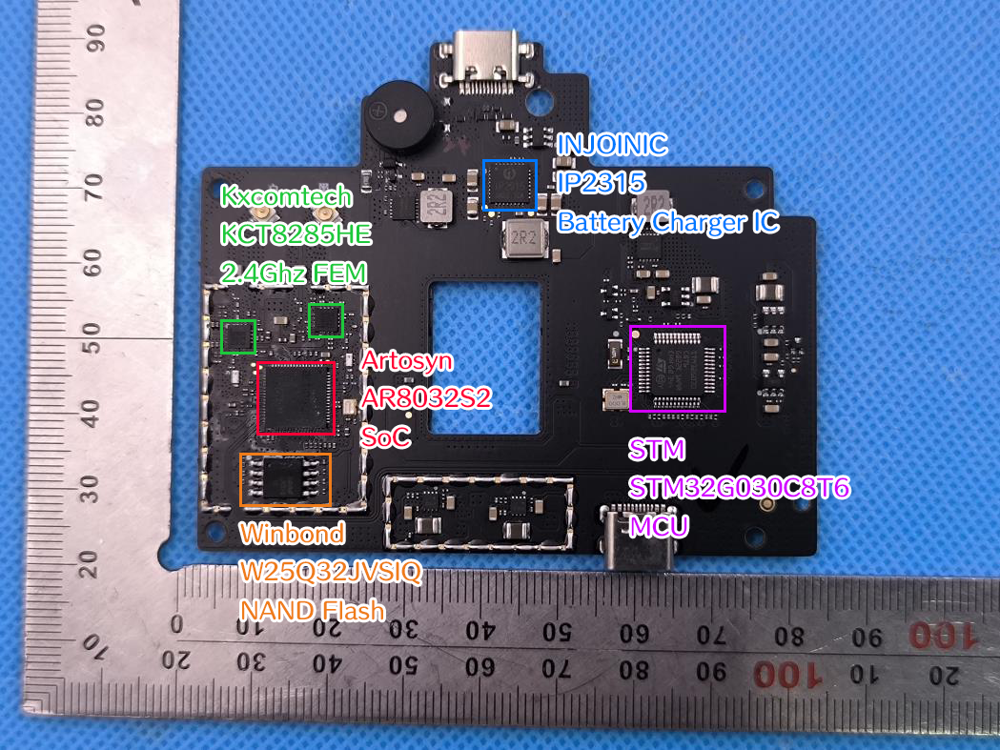

# 遥控器

## 硬件

### 主板图示

图片来自 Potensic PT 1 的 FCC 报告 (2BK8B-DSRC23A)，图片上的标注是手工标注的



### 硬件详细信息

|      类型      |  制造商   |     型号      |         规格         |                         手册或详情页                         |
| :------------: | :-------: | :-----------: | :------------------: | :----------------------------------------------------------: |
|  嵌入式控制器  |    STM    | STM32G030C8T6 |   64Mhz Cortex-M0+   | [详情页](https://www.st.com/en/microcontrollers-microprocessors/stm32g030c8.html) |
|      图传      |  Artosyn  |   AR8032S2    | XuanTie E907 RV32IMA | [Artosyn 产品页](http://www.artosyn.cn/official_product/list/9/11.html), [XuanTie E907 详情页](https://www.xrvm.cn/product/xuantie/E907) |
|    射频前端    | Kxcomtech |   KCT8285HE   |      2.4Ghz FEM      |    [详情页](https://www.kxcomtech.com/product/info/1064)     |
|     存储器     |  Winbond  |  W25Q32JVSIQ  |  4MB SPI NOR Flash   |                                                              |
| 锂电池充电芯片 |  INJONIC  |    IP2315     |                      |     [详情页](https://www.injoinic.com/product/detail/36)     |

1. 在以上列表之 "手册或详情页" 部分中
	1. "详情页" 表示页面具有这个产品的 DataSheet、UserManual 等全面的资料
	2. "产品页" 表示页面具有这个产品的部分规格信息，但没有较为详尽的资料
	3. 留空表示没有找到这个制造商官网的资料，但仍可能存在第三方资料

其中，STM 32 用作处理按键输入、指示灯、电池等，AR8032S2 用作与无人机、手机 App 通信

---

## 软件

遥控器的软件部分之分析暂未取得更多进展

### 升级包

Potensic 使用一个自定义的软件升级包体，后缀是 .bin。由 4 字节的头部 Magic，以 JSON 存储的 Metadata，经过 AES-CBC 加密的数个 Chunk 组成

无人机和遥控器部分使用相同形式的升级包体，但 AES-CBC 的 Key 不同

Metadata 部分的格式如下所示，提取自 19.01 版本的遥控器端升级包

```json
{
    "modules": [
        {
            "dev_id": [
                88
            ],
            "md5": "70a58e5501dda0d08825389c0a2990ae",
            "name": "RC_atom2rc_v2.1.5_20241120.bin",
            "padded_size": 36640,
            "prio": 61,
            "product_type": "atom2rc",
            "size": 36640,
            "type": "rc",
            "version": "2.1.5"
        },
        {
            "dev_id": [
                226
            ],
            "md5": "809edfe024e71154dce57dc0fc0eb030",
            "name": "ITG_atom2rc_v1.0.13_20251128.bin",
            "padded_size": 972656,
            "prio": 80,
            "product_type": "atom2rc",
            "size": 972644,
            "type": "itg",
            "version": "1.0.13"
        }
    ],
    "product_type": "atom2rc",
    "version": "019.01"
}
```

其中 RC 部分指 STM32，ITG 部分指 AR8032S2