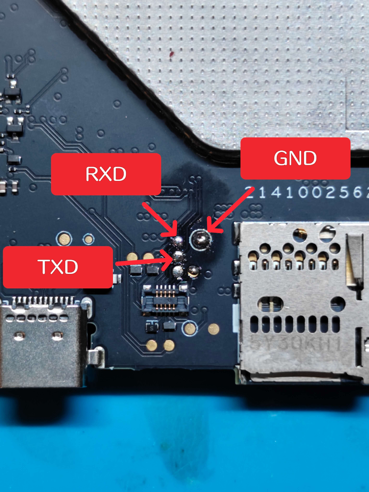
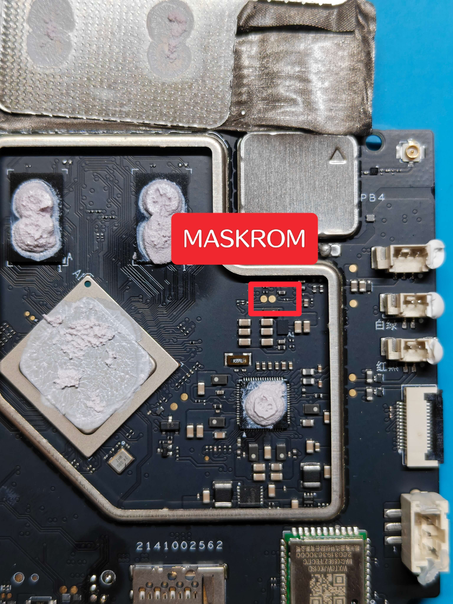
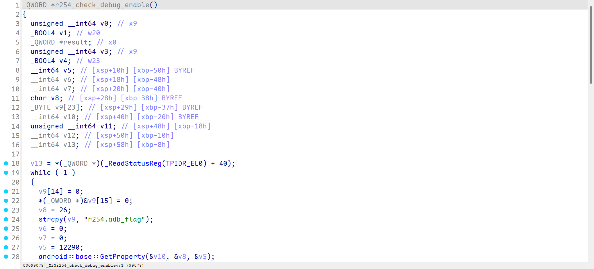
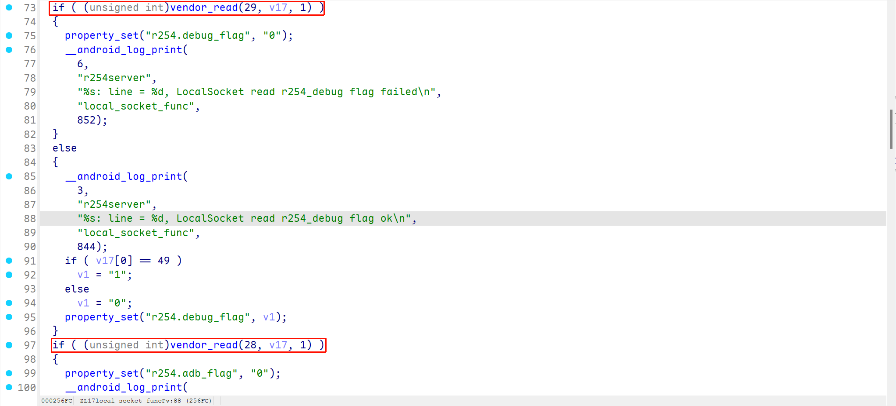
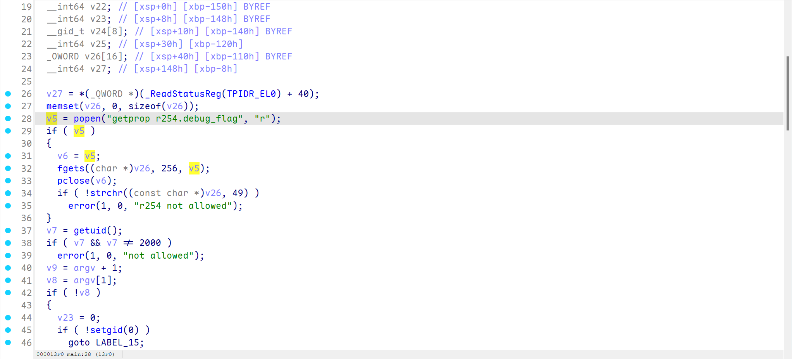

# 概述

Potensic PTD 带屏遥控器目前有 2 种型号，其规格是相近的，在此处合并介绍

---

## 硬件

|     类型     |  制造商  |   型号   |         规格         |                         手册或详情页                         |
| :----------: | :------: | :------: | :------------------: | :----------------------------------------------------------: |
|    处理器    | Rockchip |  RK3568  | 4 × 2Ghz Cortex-A55  | [详情页](https://www.rock-chips.com/a/cn/product/RK35xilie/2021/0113/1275.html) |
|     RAM      |   TWSC   |          |       DDR4 2GB       |                                                              |
|     ROM      |   TWSC   |          |      eMMC 32GB       |                                                              |
|     图传     | Artosyn  | AR8032S2 | XuanTie E907 RV32IMA | [Artosyn 产品页](http://www.artosyn.cn/official_product/list/9/11.html), [XuanTie E907 详情页](https://www.xrvm.cn/product/xuantie/E907) |
| 嵌入式控制器 |   STM    |          |                      |                                                              |

1. 因为缺少更多硬件信息，目前所了解的信息如上。将会按照实际情况补充更为具体的信息
2. 似乎所有外围按键都与嵌入式控制器相连而不是 RK3568，**目前还没有找到有效的进入 MaskROM、Loader 或 Recovery、Fastboot、Fastbootd 的按键组合**，但仍能够通过 Shell 的 "reboot loader" 进入

### TTL

经过测试，如下标记的点位是 TTL 串口，逻辑电平为 1.8V，以波特率 1500000 通信

### MaskROM

经过测试，如下标记的点位在短接后可以进入 MarkROM 模式，其中右侧点位是 GND

---

## 软件

除了嵌入式部分，Potensic PTD 在 Rockchip RK3568 上运行着一个 Android 操作系统，版本是 12L，内核版本是 4.19.232

在对 Android 系统进行分析时，有一些问题被发现

1. Android 使用 Rockchip RK356X Android 12 SDK 中默认的 platform.key 作为 Platform 签名，**这意味着任何人都能够伪造系统级的 APK**

2. Android 使用 Rockchip RK356X Android 12 SDK 中默认的 testkey 作为 OTA 签名，**这意味着任何人都能够伪造有效的 OTA 升级包**
3. Bootloader 未锁定，Android 处于 Orange State
4. /system/xbin 存在 su 可执行文件 *
5. USB 调试开启 *

标记有星号的条目，表示这个问题存在，但需要通过某些方式触发，在默认情况下无法利用

Android 系统使用 Potensic Eve 作为默认 Launcher。系统对于 SystemUI 等组件处理裁剪较多，因此大部分 (Lawnchair、Nova Launcher、Launcher3、POCO Launcher) 第三方 Launcher 都无法正常使用

Potensic Eve 具有 Share UID，可以被视作是系统的一部分，对一些细节的处理也与一般 Android 版本的 Potensic Eve 有所不同。有关这一点，还缺乏更多考证

### USB 调试

Potensic PTD 默认情况下会启动 adbd，但处于 Offline 状态，这是因为 adbd 和 /vendor/bin/r254server 中的鉴权

当 "r254.adb_flag" 为 true 时，才会开启 adb

/vendor/bin/r254server 使用 "vendor_read" 函数读取 Rockchip 平台特有的 Vendor Storage 中的 flag，并设置 r254.adb_flag、r254.debug_flag

> Vendor Storage 是 Rockchip 平台专有的非易失性存储，用于存储 SN、MAC 等信息，从 uboot 开始全链路可读写

使用 Rockchip SDK 提供的 vendor_storage 可执行程序或其他 Vendor Storage 的实现，对上述 ID 写入 true，即可实现持久化的 adb

### SU

/system/xbin/su 也具有和 adbd 相似的鉴权

使用 Rockchip SDK 提供的 vendor_storage 可执行程序或其他 Vendor Storage 的实现，对上述 ID 写入 true，即可实现持久化的 su

### Fastboot

Potensic PTD 没有实现 fastboot，如果通过 uboot 或 Shell 尝试重启进入 fastboot，则会进入 RkUsb 也就是 Loader 模式

